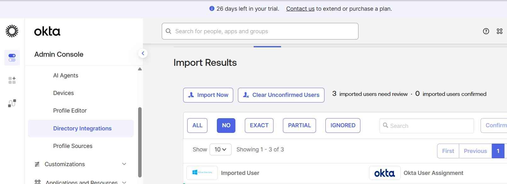
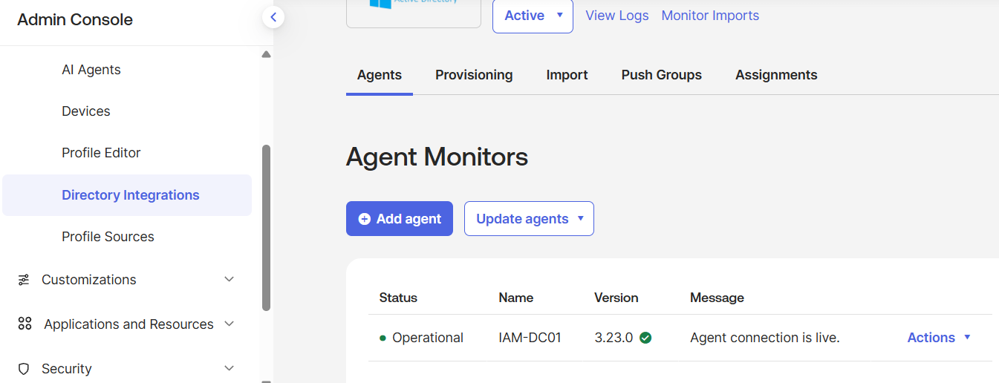

Okta + Active Directory IAM Lab

## Project Overview
This project documents my hands-on Identity and Access Management (IAM) lab using Okta and Microsoft Active Directory. The purpose of this lab is to develop practical experience with identity management, directory integration, user and group administration, profile mapping, and troubleshooting.

## Lab Environment
- Okta
- Microsoft Active Directory
- Windows Server
- Okta Active Directory Agent
- Domain Controller (DC-01)

## Objectives
- Configure an Active Directory environment for IAM practice
- Integrate Active Directory with Okta
- Install and verify the Okta Active Directory Agent
- Import and manage users and groups
- Explore directory synchronization
- Configure profile mappings
- Troubleshoot synchronization and agent connectivity issues

## Hands-On Activities
During this lab, I worked with users and groups in Active Directory and connected the directory environment to Okta.

I configured and verified the Okta Active Directory Agent, performed directory imports, reviewed user and group information, and worked with Okta profile mappings.

## Troubleshooting Experience
During the integration process, I encountered synchronization and connectivity issues between Active Directory and Okta.

I investigated the environment by:
- Verifying the Okta AD Agent service was running
- Reviewing agent operational status
- Checking system time synchronization
- Reviewing profile mappings
- Re-running directory imports
- Confirming successful user and group scans

After troubleshooting, the environment successfully scanned 3 users and 3 groups.

## Skills Demonstrated
- Identity and Access Management (IAM)
- Okta Administration
- Microsoft Active Directory
- User and Group Management
- Directory Integration
- Profile Mapping
- Identity Synchronization
- Technical Troubleshooting

## Screenshots
Sanitized screenshots documenting the configuration and troubleshooting process will be added to this repository.

> Security Note: Sensitive information such as passwords, tokens, private URLs, and personally identifiable information will not be included in this repository.
> ### Active Directory Import Results
This screenshot demonstrates the Okta and Active Directory integration during the directory import and user assignment process.

### Okta AD Agent Operational Status
This screenshot shows the Okta Active Directory Agent in an operational state, confirming that the agent connection between Okta and the Active Directory environment is live.

## What I Learned
This lab strengthened my understanding of how an identity provider such as Okta can integrate with an on-premises directory environment. It also provided hands-on experience troubleshooting identity synchronization issues and verifying communication between systems.

## Next Steps
As I continue developing my IAM and cybersecurity skills, I plan to expand this lab with additional identity lifecycle management, authentication, access control, and security exercises.
